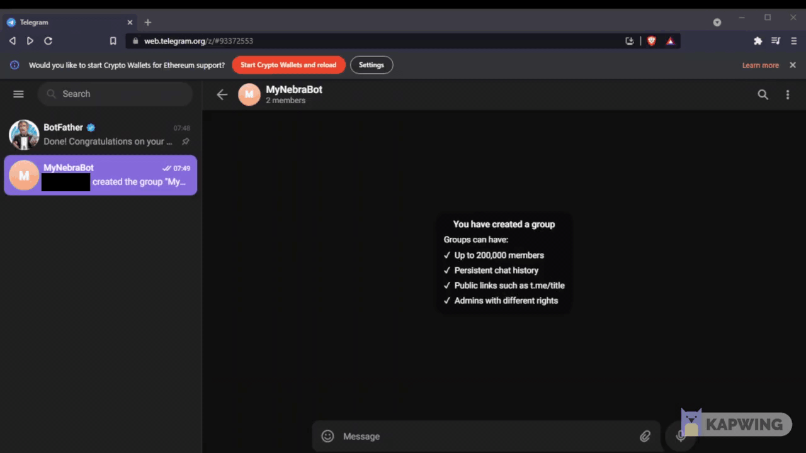

# Nebra caretaker - TP-Link

A bot to control and routinely monitor a Nebra Helium hotspot.

Interfaces with TP-Link smart plugs for automatic restarts.

Can be controlled using Telegram.

## Supporting this project

If you like this project and feel compelled to contribute, feel free to tip my HNT wallet.


## Overview

Nebra hotspots have a diagnostic interface which can be found by navigating to its local IP in a browser (http://192.168.x.x/?json=true)

There is no control interface provided at this address so when there are issues with the hotspot, restarts must be conducted manually.

Using a smart plug provides a programmable interface for restarting the miner. This smart plug can be controlled using apps such as KASA. However, this bot uses the smart plug's local API interface, thus must be deployed on the same network as the smart plug.

The bot periodically queries the miner IP for diagnostic reports, if an issue is detected then the bot will restart the miner.

A Telegram interface is also included to allow manual control of the smart plug and to get status updates about the miner.

## Testing

This bot has been tested with an outdoor Nebra hotspot (gen 1) and a TP Link HS100.

It would be great to get more hotspots and smart plugs supported so please contribute if you can.

## Configuration

### Smart plug

Install the smart plug and follow the manufacturer's instructions in connecting it to a home WIFI network.

Once this is done, find the IP address of the plug. This can typically be found by browsing to a router administration page. On Windows or Ubuntu, local IPs can be found using the command `arp -a` in a terminal

The TP-Link plug operates on 2.4GHz, some router admin pages allow filtering devices by frequencies.

If you still can't find it, unplug the smart plug, make a note of the online devices, then plug it back in and look for the new one.

If you are able to, configure your router to keep the miner and the TP-Link plug at the same local IP address.

For an interesting article on TP-Link smart plugs, click here: https://www.softscheck.com/en/reverse-engineering-tp-link-hs110/

### Telegram

Use BotFather to create a new Telegram bot and create a group with the bot as a member

Take note of the bot token and the chat ID of the created group 


To make your bot private and ensure nobody else can control it, use BotFather to disable your bot from joining any other groups using the `/setjoingroups` command.



see here for more: https://sarafian.github.io/low-code/2020/03/24/create-private-telegram-chatbot.html

### Bot

All bot configurations are done by creating a file at `app/user.cfg`

An example has been provided at `example.user.cfg`, please copy this file to the same directory and change the settings.

| Variable | Description |
|---|---|
| TELEGRAM.token | The long ID string supplied by BotFather (under "Use this token to access the HTTP API") |
| TELEGRAM.chat_id | The ID of the group chat, go to the group in the Telegram web client and enter everything after the `#` in the URL |
| TPLINK.ip | The local IP address of the TP-Link smart plug (usually 192.168.X.X) |
| TPLINK.port | For the plug I tested this code on, this was `9999` for the TP-Link Smart Home Protocol, go [here](https://www.softscheck.com/en/reverse-engineering-tp-link-hs110/) for more info |
| MINER.ip | The local IP address of the miner |
| SETTINGS.auto_reboot | Either `True` or `False`; sets whether or not automatic reboots are enabled when the bot starts (this can be changed later via Telegram) |
| SETTINGS.heartbeat | Either `True` or `False`; sets whether or not a routine heartbeat message is sent, saying that everything is okay

## Install and run

The bot can be run in Python or Docker.

Ensure the file `user.cfg` has been created in the `app` directory.

### Python 

This has been tested on Python 3.9, requirements can be installed by navigating to the `app` directory and running the command:

```shell
pip install -r requirements.txt
```

The bot is started by running the command

```shell
python main.py
```

from the `app` directory.

By default, this code will not automatically restart on a machine power cycle. For advice on how to do this in Windows, go [here](https://www.codespeedy.com/how-to-run-a-python-file-when-windows-starts/), and for Ubuntu go [here](https://stackoverflow.com/questions/24518522/run-python-script-at-startup-in-ubuntu)

### Docker

Docker installation instructions: https://docs.docker.com/engine/install/

The configuration in the `docker-compose.yml` file automatically restarts the bot whenever Docker Engine restarts.

To run the bot for the first time, use the command:

```shell
docker-compose up --build -d
```

Subsequent runs can be started using:

```shell
docker-compose up -d
```

If the code is updated, the image will need to be built again using the first command.

To follow logs, find the container ID using

```shell
docker ps
```

and then, using only the first few characters of the container ID, run the command:

```shell
docker logs -tf --tail 50 <container_id>
```

## Commands

| Command | Description |
|---|---|
| `/help` |  Display this help message |
| `/status` | Get miner info |
| `/on` | Turn TP-Link plug on |
| `/off` | Turn TP-Link plug off |
| `/reboot` | Turns the TP-Link plug off then on, with a 30s delay |
| `/disablereboot` | Disables automatic reboot of the TP-Link |
| `/enablereboot` |  Enables automatic reboots of the TP-Link |
| `/disableheartbeat` | Disables the heartbeat message for when the miner is running with no issues |
| `/enableheartbeat` | Enables the heartbeat message for when the miner is running with no issues |

## License

MIT

## Disclaimer

As per the license this software is provided with no warranty of any kind.

The automatic restart feature has not yet been tested fully because my miner has not gone offline yet.

## Other thoughts

I had no idea the TP-Link protocol was so open. Anyone connected to your local network can effectively control your devices just by sending a simple HTTP request to the local IP.

It would be so easy for malware to scan for these ports on a local network and shut everything down.

Be careful with these plugs.